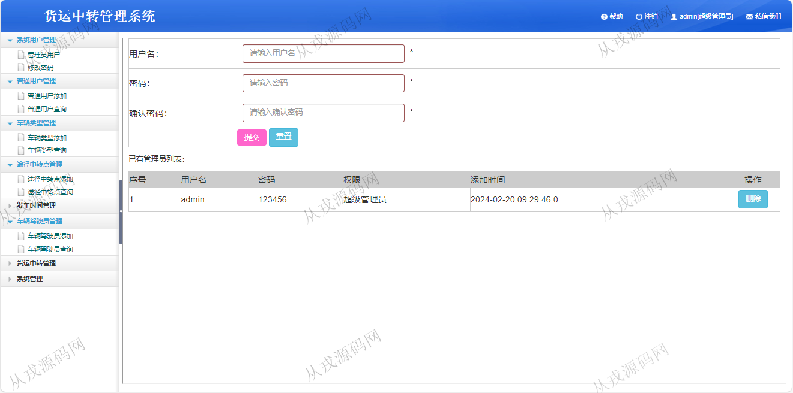
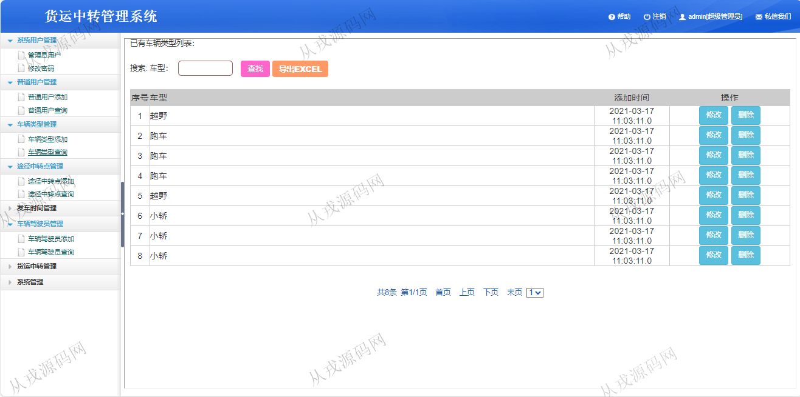
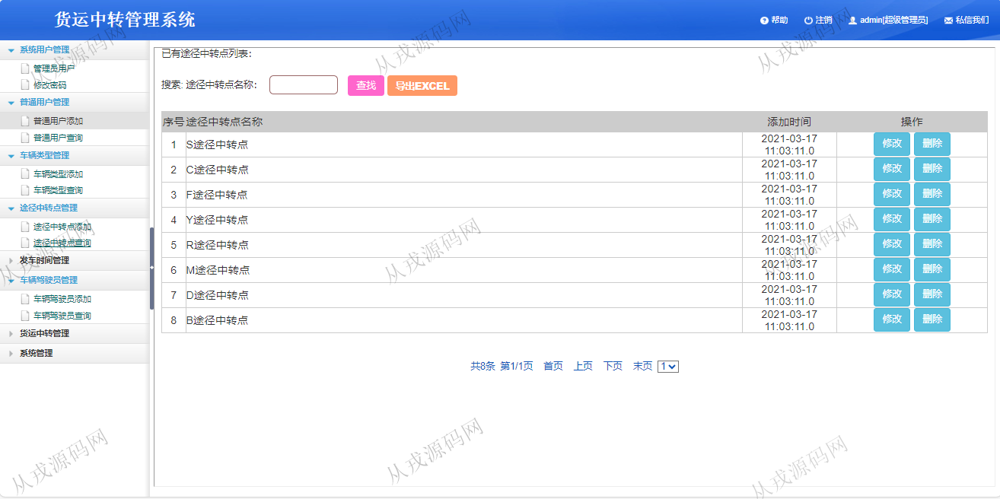
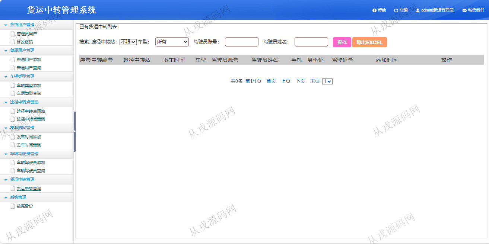
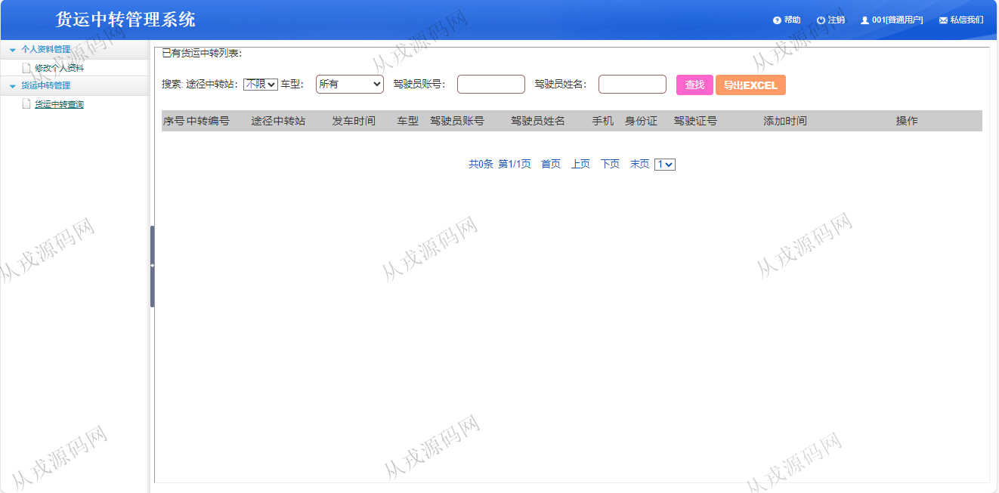
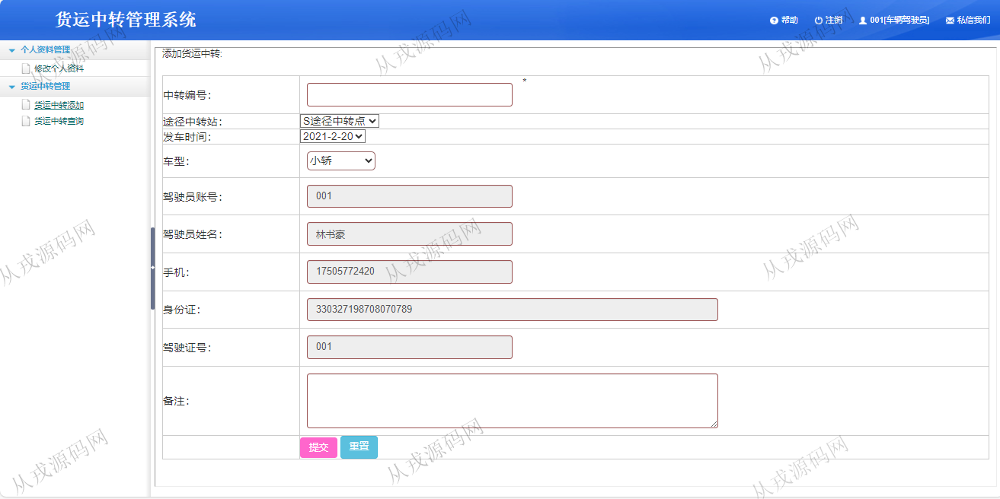

<h1 align="center">226.货运中转管理系统</h1>

- <b>完整代码获取地址：从戎源码网 ([https://armycodes.com/](https://armycodes.com/))</b>
- <b>技术探讨、资料分享，请加QQ群：692619798</b> 
- <b>作者微信：19941326836  QQ：952045282</b> 
- <b>承接计算机毕业设计、Java毕业设计、Python毕业设计、深度学习、机器学习</b>
- <b>选题+开题报告+任务书+程序定制+安装调试+论文+答辩ppt 一条龙服务</b>
- <b>所有选题地址 ([https://github.com/YuLin-Coder/AllProjectCatalog](https://github.com/YuLin-Coder/AllProjectCatalog)) </b>

## 项目介绍
基于java+jsp的货运中转管理系统：前端 jsp、ajax，后端 servlet、jdbc；角色分为管理员、普通用户、车辆驾驶员；集成车辆类型、途径中转点、货运中转等功能于一体的系统。

## 功能介绍

- 系统用户管理：管理员用户列表查询，用户添加和删除，密码修改
- 普通用户管理：添加普通用户，普通用户列表查询，按用户名、身份证搜索用户，导出excel
- 车辆类型管理：车辆类型信息的增删改查
- 途径中转点管理：途径中转点信息的增删改查
- 发车时间管理：发车时间信息的增删改查
- 车辆驾驶员管理：车辆驾驶员信息的增删改查
- 货运中转管理：管理员和普通用户可以查询，驾驶员可以添加中转信息

## 环境

- <b>IntelliJ IDEA 2021.3</b>

- <b>Mysql 5.7.26</b>

- <b>Tomcat 7.0.73</b>

- <b>JDK 1.8</b>

## 运行截图

