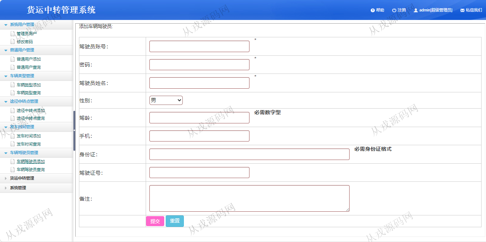

<h1 align="center">226.货运中转管理系统</h1>

 获取sql文件 QQ: 386869957 QQ群: 377586148 

 [更多源码项目: 从戎源码网](https://armycodes.com/) 

## 简介

> 本代码来源于网络,仅供学习参考使用!
>
> 提供1.远程部署/2.修改代码/3.设计文档指导/4.框架代码讲解等服务
>
> 访问地址：http://localhost:8080/login.jsp
> 
> 管理员：admin 123456
> 
> 普通用户：001 123456
> 
> 车辆驾驶员：001 123456
>

## 项目介绍
基于java+jsp的货运中转管理系统：前端 jsp、ajax，后端 servlet、jdbc；角色分为管理员、普通用户、车辆驾驶员；集成车辆类型、途径中转点、货运中转等功能于一体的系统。

## 功能介绍

- 系统用户管理：管理员用户列表查询，用户添加和删除，密码修改
- 普通用户管理：添加普通用户，普通用户列表查询，按用户名、身份证搜索用户，导出excel
- 车辆类型管理：车辆类型信息的增删改查
- 途径中转点管理：途径中转点信息的增删改查
- 发车时间管理：发车时间信息的增删改查
- 车辆驾驶员管理：车辆驾驶员信息的增删改查
- 货运中转管理：管理员和普通用户可以查询，驾驶员可以添加中转信息

## 环境

- <b>IntelliJ IDEA 2021.3</b>

- <b>Mysql 5.7.26</b>

- <b>Tomcat 7.0.73</b>

- <b>JDK 1.8</b>

## 运行截图

